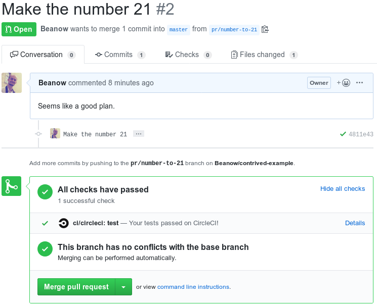
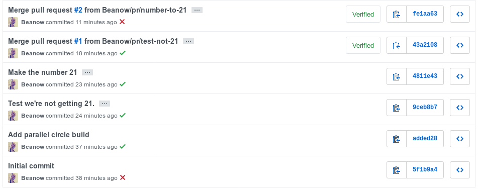

# Contrived example

This is intended to test whether GitHub can show a PR as green when it will definitely fail when performing an auto-merge.

## The scenario

We've got two PRs which will pass tests on their own.
But in combination will fail.

Each PR will look OK because they're tested individually and don't cause merge conflicts.

### Both look OK

Both PR [#1](https://github.com/Beanow/contrived-example/pull/1) and
[#2](https://github.com/Beanow/contrived-example/pull/2) look ok.

Their tests being [job #17](https://circleci.com/gh/Beanow/contrived-example/17) and
[job #18](https://circleci.com/gh/Beanow/contrived-example/18)

### Now #1 is merged

The test and deploy workflows are triggered and both turn out green.
[job #19](https://circleci.com/gh/Beanow/contrived-example/19) and
[job #20](https://circleci.com/gh/Beanow/contrived-example/20)

```
./publish.sh

Publishing with number 42
```

### PR #2 is still green

Even though #1 is merged, it doesn't cause merge conflicts.
The test that was done for this PR is still
[job #18](https://circleci.com/gh/Beanow/contrived-example/18).



### The merge

Merging [#2](https://github.com/Beanow/contrived-example/pull/2) as well,
it auto-merges with the previous changes from [#1](https://github.com/Beanow/contrived-example/pull/1).
Because merging with master causes a new test to run, it fails the tests.

[job #21](https://circleci.com/gh/Beanow/contrived-example/21)
```
./test/unit-test.sh

The number should not be equal to 21
Exited with code 1
```

However, because this was done in parallel, we did publish the invalid code.

[job #22](https://circleci.com/gh/Beanow/contrived-example/22)
```
./publish.sh

Publishing with number 21
```

To summarize this, you can look at the commit history.
The first ❌ we get is when [#2](https://github.com/Beanow/contrived-example/pull/2) is already merged.


